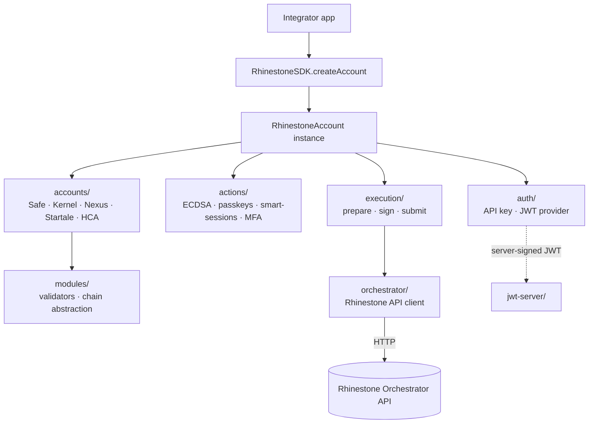
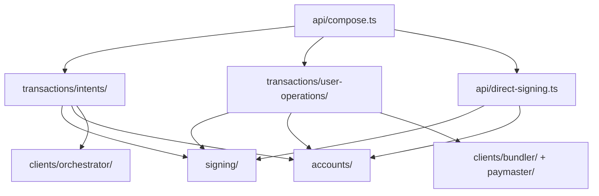
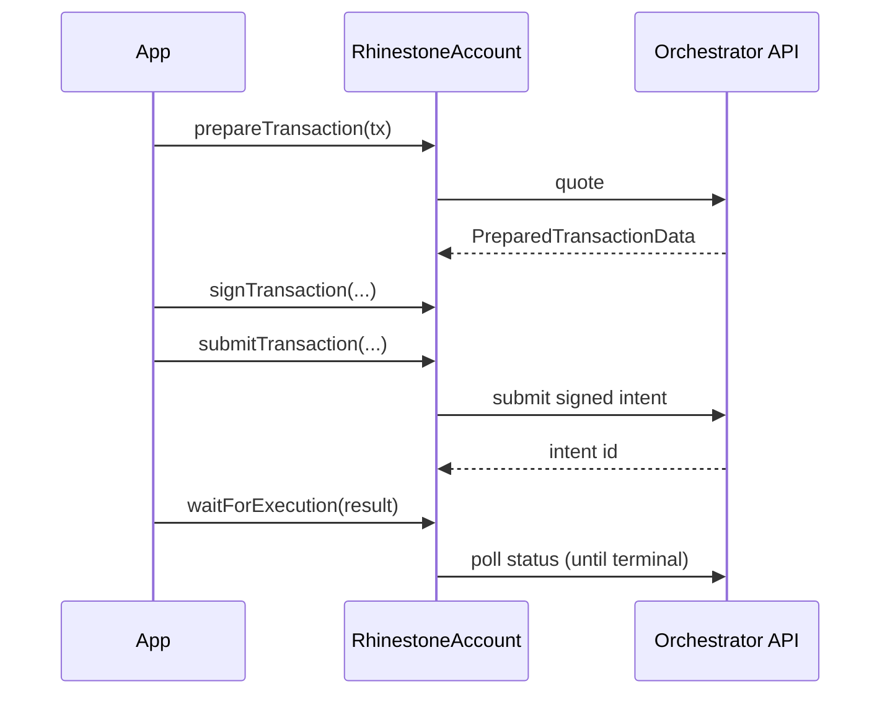

# Architecture

How the SDK is layered and how a transaction flows from an app call to an
onchain result. For the published API, see the generated [SDK
Reference](https://docs.rhinestone.dev); this doc is the internal map.

## System

## Building blocks

- **`RhinestoneSDK` / `createAccount`** (`src/index.ts`) — entry point.
  `new RhinestoneSDK(config).createAccount(accountConfig)` resolves config and
  returns a `RhinestoneAccount` instance; all flows hang off that object.
- **`accounts/`** — account implementations (Safe, Kernel, Nexus, Startale, and
  the ENS HCA factory). Each maps the unified config to that account's onchain
  init data, module layout, and signing. `signing/` holds per-account signature
  packing; `json-rpc/` the bundler/RPC glue.
- **`actions/`** — atomic account operations exposed as the public `/actions`
  subpath: ECDSA owner management, passkeys, smart sessions, MFA.
- **`modules/`** — module validators and the chain-abstraction config
  (`chain-abstraction.ts`), plus onchain reads (`read.ts`) for owners,
  validators, and executors.
- **`execution/`** — the prepare → sign → submit machinery shared by the intent
  and user-operation paths.
- **`orchestrator/`** — the Rhinestone API client. Owns quoting, intent
  submission, and status polling, the typed error hierarchy (`error.ts`), token
  registry (`registry.ts`), chain catalog (`destinations.ts`), CAIP-2
  conversion (`caip2.ts`), and the generated wire types. See
  [codegen.md](codegen.md) for how the wire types are produced.
- **`auth/`** — auth provider: API-key mode (key sent directly) or JWT mode
  (short-lived token signed by a backend).
- **`jwt-server/`** — server-side JWT signer (Express + Web handlers) for the
  JWT auth mode, published as the `/jwt-server` subpath.

## Execution paths

### Rewrite transition

Commit 6 keeps the published facade on `execution/` while completing the new
internal composition used by characterization tests. The new composition is
owned by `api/compose.ts` and separates the operation workflows as follows:

`transactions/` is an organizational namespace, not a shared protocol layer.
Intent and UserOperation request models, preparation, submission, and status
remain separate. They share account materialization, call resolution, signing
plans/execution, chain data, clocks, and narrow client ports through their
owning top-level subsystems. Direct account signing uses the same signing core
without belonging to either transaction workflow.

The account exposes two ways to execute, both ending at `waitForExecution`.

### Intent path (chain-abstracted)

The default path. The orchestrator quotes, routes, and settles across chains via
the relayer market; the SDK signs and submits.

1. `prepareTransaction(tx)` — SDK requests a quote from the orchestrator and
   returns `PreparedTransactionData`.
2. `getTransactionMessages(...)` — typed-data messages to sign (optional; for
   headless signing).
3. `signTransaction(...)` — signs the origin/destination/target-execution typed
   data with the account's validator. Multisig owners can instead call
   `signTransaction(prepared, { owner })` independently and combine their
   contributions with `assembleTransaction(...)`.
4. `submitTransaction(...)` — posts the signed intent; returns a
   `TransactionResult` (an intent id).
5. `waitForExecution(result)` — polls the orchestrator until the intent reaches
   a terminal state; throws `IntentFailedError` on failure.

### User-operation path

ERC-4337 path for direct bundler execution:
`prepareUserOperation` → `signUserOperation` → `submitUserOperation`, or
`sendUserOperation` to do all three in one call. Returns a UserOp hash;
`waitForExecution` resolves the receipt.

## External integrations

| System                  | Purpose                                  | Interface       |
| ----------------------- | ---------------------------------------- | --------------- |
| Rhinestone Orchestrator | Intent quoting, routing, status          | HTTP (`orchestrator/`) |
| Relayer market          | Cross-chain settlement (Across/Relay/Eco) | via orchestrator |
| Bundler / RPC           | ERC-4337 user-operation submission       | viem (peer)     |
| JWT backend             | Mints short-lived auth tokens (JWT mode) | `jwt-server/`   |
