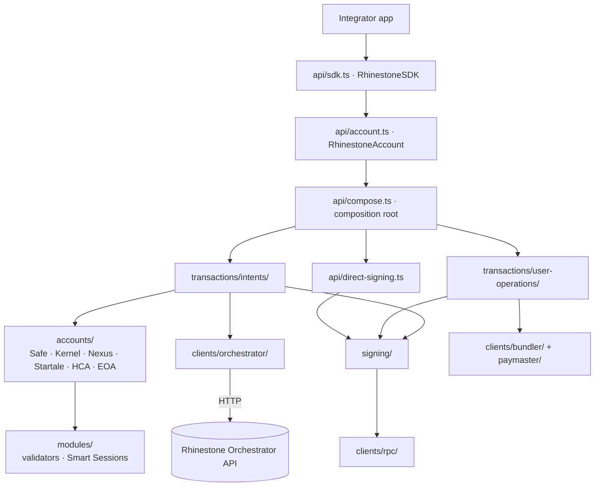
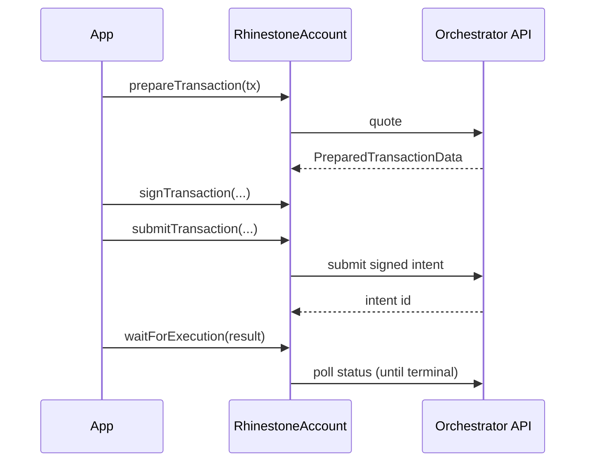

# Architecture

How the SDK is layered and how a transaction flows from an app call to an
onchain result. For the published API, see the generated [SDK
Reference](https://docs.rhinestone.dev); this doc is the internal map.

## System

## Layering

The rewrite is a pure core with an imperative shell. Dependencies flow one way,
enforced by `scripts/architecture/check.ts`:

- **`api/`** — the composition root and public facade. `sdk.ts` (`RhinestoneSDK`)
  and `account.ts` (`RhinestoneAccount`) are the entry points; `compose.ts`
  wires concrete clients into the workflows; `queries/` holds the small
  portfolio and app-fee reads. Only `api/` may import concrete clients.
- **`config/`** — public config types (`config/account.ts`) and resolution
  (`resolve.ts`) from the public config into the narrow invocation context the
  internals consume. Internals never take the aggregate `RhinestoneConfig`.
- **`chains/`, `calls/`** — the universally-importable base: chain catalog,
  CAIP-2, tokens, non-EVM descriptors, and call resolution.
- **`accounts/`** — account adapters (Safe, Kernel, Nexus, Startale, HCA, EOA).
  Each maps resolved config to that account's init data, module layout, and
  signature envelope. The registry selects the adapter by kind.
- **`modules/`** — module planning and validators (ECDSA, ENS, WebAuthn,
  multi-factor, K1), including the Smart Sessions subsystem
  (`modules/validators/smart-sessions/`).
- **`signing/`** — the signing pipeline: signing plans, signer invocation,
  protocol codecs (ERC-6492/7739), and intent-plan assembly.
- **`transactions/`** — an organizational namespace, not a shared protocol. The
  `intents/` and `user-operations/` workflows keep their own request models,
  preparation, submission, and status; they share account materialization, call
  resolution, signing, chain data, and narrow client ports through the
  subsystems above.
- **`clients/`** — ports and adapters for the orchestrator, RPC, bundler, and
  paymaster. Domain and workflow code imports only the stable `port.ts`,
  `types.ts`, `errors.ts`, and `public.ts` boundaries; concrete clients are
  injected at `api/compose.ts`.
- **`actions/`, `errors/`, `utils/`, `smart-sessions/`, `jwt-server/`** —
  published subpath surfaces. `actions/` are standalone builders; the rest are
  compatibility barrels re-exporting owning symbols, except `jwt-server/`, a
  separate server-side bounded context with optional `jose`/`express` peers.

## Execution paths

The account exposes two ways to execute, both ending at `waitForExecution`.

### Intent path (chain-abstracted)

The default path. The orchestrator quotes, routes, and settles across chains via
the relayer market; the SDK signs and submits.

1. `prepareTransaction(tx)` — SDK requests a quote from the orchestrator and
   returns `PreparedTransactionData`.
2. `getTransactionMessages(...)` — typed-data messages to sign (optional; for
   headless signing).
3. `signTransaction(...)` — signs the origin/destination/target-execution typed
   data with the account's validator. Multisig owners can instead call
   `signTransaction(prepared, { owner })` independently and combine their
   contributions with `assembleTransaction(...)`.
4. `submitTransaction(...)` — posts the signed intent; returns a
   `TransactionResult` (an intent id).
5. `waitForExecution(result)` — polls the orchestrator until the intent reaches
   a terminal state; throws `IntentFailedError` on failure.

### User-operation path

ERC-4337 path for direct bundler execution:
`prepareUserOperation` → `signUserOperation` → `submitUserOperation`, or
`sendUserOperation` to do all three in one call. Returns a UserOp hash;
`waitForExecution` resolves the receipt.

## External integrations

| System                  | Purpose                                   | Interface                    |
| ----------------------- | ----------------------------------------- | ---------------------------- |
| Rhinestone Orchestrator | Intent quoting, routing, status           | HTTP (`clients/orchestrator/`) |
| Relayer market          | Cross-chain settlement (Across/Relay/Eco) | via orchestrator             |
| Bundler / RPC           | ERC-4337 user-operation submission        | `clients/bundler/`, `clients/rpc/` (viem peer) |
| JWT backend             | Mints short-lived auth tokens (JWT mode)  | `jwt-server/`                |
