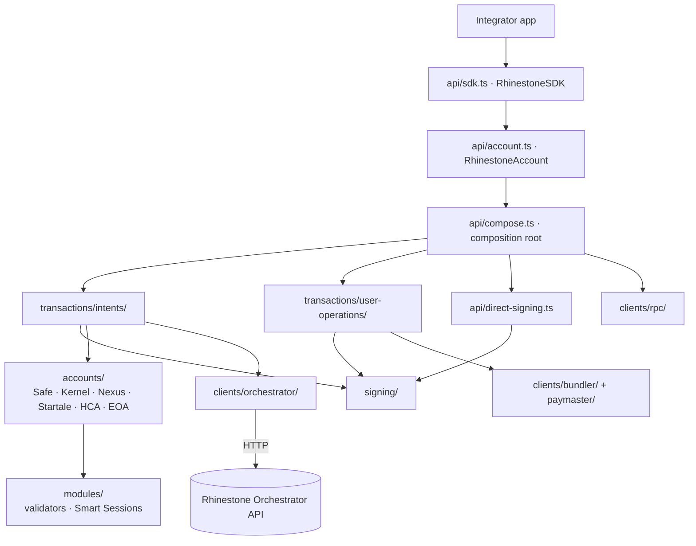
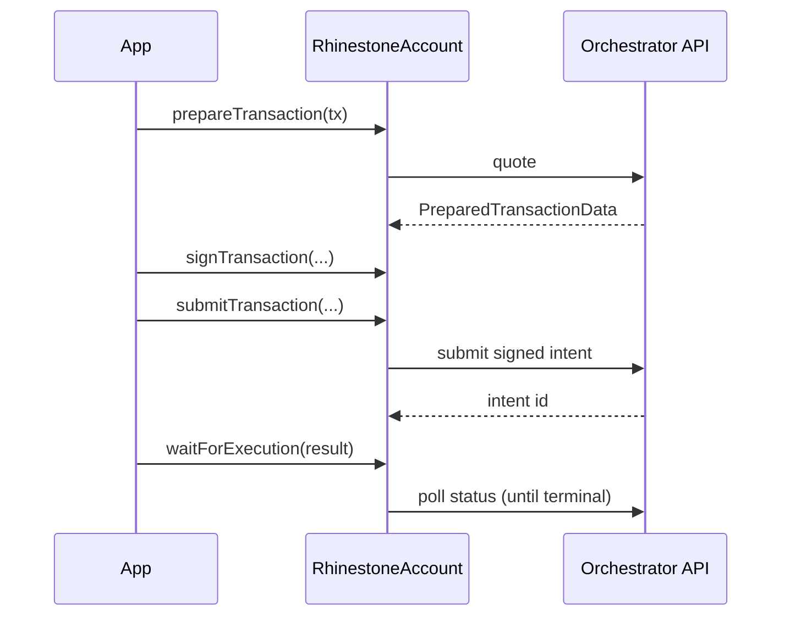

# Architecture

How the SDK is layered and how a transaction flows from an app call to an
onchain result. For the published API, see the generated [SDK
Reference](https://docs.rhinestone.dev); this doc is the internal map.

## System

```mermaid
graph TD
  App[Integrator app] --> SDK[api/sdk.ts · RhinestoneSDK]
  SDK --> Account[api/account.ts · RhinestoneAccount]
  Account --> Compose[api/compose.ts · composition root]

  Compose --> Intents[transactions/intents/]
  Compose --> UserOps[transactions/user-operations/]
  Compose --> Direct[api/direct-signing.ts]

  Intents --> Signing[signing/]
  UserOps --> Signing
  Direct --> Signing

  Intents --> Accounts[accounts/<br/>Safe · Kernel · Nexus · Startale · HCA · EOA]
  Accounts --> Modules[modules/<br/>validators · Smart Sessions]
  Intents --> Orch[clients/orchestrator/]
  UserOps --> Bundler[clients/bundler/ + paymaster/]
  Compose --> Rpc[clients/rpc/]

  Orch -->|HTTP| API[(Rhinestone Orchestrator API)]
```

## Layering

The rewrite is a pure core with an imperative shell. Dependencies flow one way,
enforced by `scripts/architecture/check.ts`:

- **`api/`** — the composition root and public facade. `sdk.ts` (`RhinestoneSDK`)
  and `account.ts` (`RhinestoneAccount`) are the entry points; `compose.ts`
  wires concrete clients into the workflows; `queries/` holds the small
  portfolio and app-fee reads. Only `api/` may import concrete clients.
- **`config/`** — public config types (`config/account.ts`) and resolution
  (`resolve.ts`) from the public config into the narrow invocation context the
  internals consume. Internals never take the aggregate `RhinestoneConfig`.
- **`chains/`, `calls/`** — the universally-importable base: chain catalog,
  CAIP-2, tokens, non-EVM descriptors, and call resolution.
- **`accounts/`** — account adapters (Safe, Kernel, Nexus, Startale, HCA, EOA).
  Each maps resolved config to that account's init data, module layout, and
  signature envelope. The registry selects the adapter by kind.
- **`modules/`** — module planning and validators (ECDSA, weighted Quorum
  Signer, ENS, WebAuthn, multi-factor, K1, social recovery), including the Smart
  Sessions subsystem (`modules/validators/smart-sessions/`).
- **`signing/`** — the signing pipeline: signing plans, signer invocation,
  protocol codecs (ERC-6492/7739), and intent-plan assembly.
- **`transactions/`** — an organizational namespace, not a shared protocol. The
  `intents/` and `user-operations/` workflows keep their own request models,
  preparation, submission, and status; they share account materialization, call
  resolution, signing, chain data, and narrow client ports through the
  subsystems above.
- **`clients/`** — ports and adapters for the orchestrator, RPC, bundler, and
  paymaster. Domain and workflow code imports only the stable `port.ts`,
  `types.ts`, `errors.ts`, and `public.ts` boundaries; concrete clients are
  injected at `api/compose.ts`.
- **`hypercore/`** — the Hyperliquid half of a HyperCore transaction.
  `resolve.ts` turns the declarative `hyperCore.openPerp` / `hyperCore.closePerp`
  on a transaction into the concrete action the orchestrator quotes against;
  `orders.ts` is the pure order arithmetic it calls, and `market.ts` the reads it
  needs. Those reads are the only place the SDK talks to a service other than
  Rhinestone's own; they take an injectable `fetch` (the `hyperliquid` SDK config
  block) rather than a composed client because nothing else in the SDK depends on
  them. `index.ts` publishes only the reads, at
  `@rhinestone/sdk/hypercore`.
- **`solana/`, `evm/`** — the VM-specific published barrels. `solana/`
  re-exports the Solana helpers, cluster descriptors and `Solana*` types;
  `evm/` the EVM init-data and wallet helpers, validator addresses and `Evm*`
  account types. The root `index.ts` keeps only VM-neutral surface.
- **`actions/`, `errors/`, `smart-sessions/`, `jwt-server/`** —
  published subpath surfaces. `actions/` are standalone builders; the rest are
  compatibility barrels re-exporting owning symbols, except `jwt-server/`, a
  separate server-side bounded context with optional `jose`/`express` peers.

## Cross-VM account boundary

The public account configuration is composite: EVM and Solana entries are
independent managed or address-only branches. `api/accounts.ts` validates and
shallow-freezes that outer boundary, then passes only a managed EVM branch into
the existing resolution and adapter stack. Receiver-only handles bypass account
resolution and expose only native address access. A managed Solana account
without managed EVM capabilities bypasses it too: `createSolanaAccountFacade`
returns a `SolanaStandaloneAccount`, typed with only what it supports (no
assembly, authorizations, owner signing or submission options). An address-only
EVM receiver may accompany that facade for address access and delivery defaults.

Managed Solana runs on two environment/endpoint pairs only: development with
`https://dev.v1.orchestrator.rhinestone.dev`, and production with
`https://v1.orchestrator.rhinestone.dev`. `api/accounts.ts` refuses any other
pair at creation, and the facade captures the pair and re-checks it on every
operation. Each environment derives EVM-paired Swigs under its own namespace
(`MANAGED_SWIG_NAMESPACES` in `accounts/solana/address.ts`: `dev-v1`, `prod-v1`),
a local mirror of that orchestrator's `SOLANA_SWIG_NAMESPACE` that must be kept
in step with it; the namespace is also bound into the execution metadata. The
SDK adds no per-environment refusals beyond that — whatever an environment
cannot serve yet, its orchestrator refuses. Its Swig must exist and carry the
configured owner as its authority on the target cluster before it can spend.
Every managed Solana
config names its state account explicitly with `swig: stateAddress`; adding,
removing, or replacing an EVM branch never selects another wallet. The SDK
derives the asset-holding wallet PDA from that state account. Plain transfers,
instructions, and cross-chain deliveries name `svm.swigAccount`, carry no
`account.evm`, bind sponsorship to the wallet, and persist no `accountType`.
The owner is an independent ECDSA key or passkey; either credential may also be
used by EVM, but each VM retains its own authorization protocol. A passkey is
named to the orchestrator by its SEC1-compressed P-256 key. Its assertion's
challenge and type are checked locally, but the orchestrator verifies the
signature. The SDK derives only PDA relationships offline with the small
`@noble/curves` and `@scure/base` primitives; it imports no Solana RPC or
transaction stack and does not verify the account onchain.

`deploy` names its VM first: `deploy('evm', chain, { sponsored })` runs the EVM
deployment, and `deploy('solana', solanaChain, { swigId })` creates the Swig
through a sponsored deployment intent (`transactions/intents/solana-deployment.ts`),
on both the standalone facade and a composite account with a managed Solana
entry. The standalone facade types `swigId` as required, because without managed
EVM the Swig is always independent. It always
sends the Solana-only shape — `svm.swigAccount` plus `initData: { authority, id }`
and no `account.evm` — with a tokenless destination and `sponsorship: { gas: true }`.
The id is computed for the Swig derived from the managed EVM account under the
environment's namespace, and otherwise must be the caller's saved id from
`createSolanaSwigId()`; an id that does not derive the configured Swig, a missing
ECDSA `publicKey`, and a changed environment or endpoint are refused before any
request. The root authority
comes only from the configured owner. The quoted `purpose: 'deployment'` route
must name exactly that Swig, wallet and authority on the requested cluster and
ask for no signatures or requirements; it is submitted with `proofs: []` and
awaited. An existing Swig (`ACCOUNT_ALREADY_DEPLOYED` naming the configured
`swig` on the requested cluster) resolves `true` without submitting; its root is not verified, since the
SDK has no Solana RPC. Execution paths refuse a
deployment route at `normalizeIntentQuote`, and public quotes stay execution-only.

A managed Solana origin accepts one same-chain SPL transfer with an explicit
recipient, one same-chain instruction execution, or one cross-chain delivery to
an EVM chain. `sponsored` is translated with the same helper EVM uses and passed
through for the orchestrator to decide on: it serves the categories a Solana
route can bill and refuses the rest by name. Native SOL, independent
owner-signature assembly and `signAuthorizations` are rejected in every
direction; EVM calls, and the EIP-7702 delegation they can need, only come with
a delivery to an EVM chain.
Address-only
Solana branches remain receiver-only. For automatic EVM cross-chain sources,
the composition reads the orchestrator chain catalog and sends only real
`eip155:` chains matching the destination's network class; source-asset filters
may narrow but never widen that set.

A Solana **destination** is delivery-only and funded from EVM sources. The
recipient resolves in order: an explicit `recipient`, the configured address-only
receiver, then the managed branch's explicitly supplied Swig wallet; delivery is refused
before quoting when none exists, and so are destination calls, instructions or
HyperCore actions.

A same-chain instruction execution runs caller-supplied Solana instructions out
of the account's own Swig wallet, so it is tokenless and names no recipient: the
payee is encoded inside the instructions. Instructions are accepted either wire-
shaped (base58 program and accounts, base64 data — what Jupiter
`/swap-instructions` returns) or as `@solana/web3.js` instruction objects, and
are normalized to the wire shape in `normalizeTransaction`, so a prepared
transaction stays JSON-round-trippable and its reconstruction compares the same
canonical intent input. Order, account metadata, signer flags and data bytes are
preserved verbatim. The published request limits (32 instructions, 64 accounts
each, 1232 bytes of data in total, 8 address lookup tables) are mirrored locally
so an oversized request fails before a round trip. The request carries
`tokenRequests: []`, `destinationInstructions`, and
`addressLookupTableAddresses` only when non-empty. No orchestrator route serves
instructions yet, so a well-formed request is refused with
`UNSUPPORTED_DESTINATION_INSTRUCTIONS`; the SDK surfaces that refusal unchanged.
The destination hosts no account runtime, so preparation runs the ordinary EVM
cross-chain path with the account hosted on the last EVM source. The
destination authorization is its own signing request; where its payload,
account and authority match an earlier slot exactly, the same bytes satisfy
both — but it stays a distinct slot with its own proof. Whether the destination wallet
and its token account exist is an operator prerequisite — the SDK does not probe
it, and a settlement layer can refuse a route that would have to create one.
Where the delivering provider names the destination chain differently from us,
that id is published on `quote.bridgeFill` as an opaque passthrough for the
provider's status API; it never enters CAIP-2 formatting or chain comparisons.

A Solana **origin** can also fund a delivery on an EVM chain. The source cluster
(`sourceChains`) and the SPL mint to spend (`sourceAssets: [{ chain, address }]`)
are both named explicitly — the route spends exactly one source token, and
`source.selection` pins the cluster and narrows it to that single mint with
`perChain`, because a chain selector alone would open every registry token on
it.

A Solana-origin transfer — the delivery, or a same-chain SPL transfer — can cap
what the wallet debits with `sourceAssets[0].amount`, the EVM source-asset
ceiling. It is distinct from the destination amount: with one the route is
exact-out and must fit under the cap, without one it spends up to the cap. The
cap adds exactly one `source.limits` entry on the pinned pair and never widens
the selection, and the normalized access list names that pair by its cap alone
(`chainTokenAmounts`), as an EVM capped entry does. Without an amount the
request and intent input are byte-identical to an uncapped transfer. Every
quote whose `cost.input` exceeds the cap is refused at prepare and again on
reconstruction, so before signing and submission. That check trusts the quote's
accounting; the orchestrator enforces the limit authoritatively. Instruction
executions take no `sourceAssets`: the orchestrator refuses source limits with
destination instructions. The cap is not repeated in the execution metadata;
rebuilding `request` and `intentInput` from `transaction` covers it. The delivery recipient is an explicit
EVM address or the configured managed EVM/receiver address, resolved before the
quote so the authorization binds to it; an account with no EVM entry has no
default, so its delivery without a recipient is refused before quoting, in its
type and at runtime. Authorization stays the Solana model: without
destination calls, exactly one signing request — `personalSign` for an ECDSA
owner, `webauthn` for a passkey —
disclosing the Swig wallet and state account it spends from, and the same
slot-bounded window, so a second prepared-but-unsubmitted spend invalidates the
first. The quoted cost legs stay in their own namespaces — a Solana chain and
base58 mint on the input, an `eip155:` chain and hex token on the output. The
settlement layer is whatever the orchestrator picked; the SDK only requires that
it is not same-chain.

A delivery can carry `calls` only when the configured managed EVM account and
explicit Swig match the backend's existing EVM-derived pair. The comparison is
a capability check, never wallet selection; an unrelated pair is refused before
lazy calls, setup reads, quoting, or signing and remains usable for plain
delivery. Address-only EVM receivers cannot execute calls. Compatible calls are
resolved against the managed EVM account before the quote, whose entry carries
setup ops and any EIP-7702 delegation. The request names no recipient because
the executing account receives the delivery, so an explicit `recipient` with
calls is refused.
The quote asks for the Swig spend first, then the EVM account's EIP-712
authorization of the calls on the delivery chain, then any delegation there.
Those EVM requests are signed first through the ordinary EVM signing path,
because the spend's slot window is the one that runs out, and the proofs go out
in request order. A replay rebuilds the resolved calls and account setup from
the persisted `intentInput` instead of resolving them again, and compares the
rebuilt wire request with the exact persisted request before any signature.

## Execution paths

The account exposes two ways to execute, both ending at `waitForExecution`.

### Intent path (chain-abstracted)

The default path. The orchestrator quotes, routes, and settles across chains via
the relayer market; the SDK signs and submits.

1. `prepareTransaction(tx)` — SDK requests a quote from the orchestrator and
   returns `PreparedTransactionData`.
2. `getTransactionMessages(...)` — returns the quote's **ordered** signing
   requests. Each names the account, the authority, the scope it authorizes and
   the payload to sign: EIP-712 for EVM authorizations, one `personalSign`
   message (a `webauthn` challenge for a passkey owner) with a short slot
   deadline for a managed Solana origin, an EIP-7702
   authorization tuple for a requested delegation. Position is the identity of
   an authorization — two requests can carry the same payload and still be two
   distinct slots.
3. `signTransaction(...)` — returns one proof per signing request, in that order,
   including any EIP-7702 delegation the quote asked for. EVM multisig owners
   can instead call `signTransaction(prepared, { owner })` independently and
   combine their contributions with `assembleTransaction(...)`, optionally
   folding in externally collected `proofs`; managed Solana does not support
   this path.
4. `submitTransaction(...)` — posts the intent id and the complete proof vector;
   returns a `TransactionResult` (an intent id). It acquires no signatures and
   reads no mutable nonce state.
5. `waitForExecution(result)` — polls the orchestrator until the intent reaches
   a terminal state; throws `IntentFailedError` on failure. Status groups every
   operation by the chain it ran on, so a chain carrying both a claim and a fill
   reports both. `getIntentStatus(id, { full: true })` additionally returns the
   recorded detail block; polling stays lean by default.

Weighted Quorum Signer accounts collapse multi-origin intent signing into one
chain-agnostic EIP-712 `WeightedMerkleRoot` signature. Each origin receives an
account-bound Merkle proof, so the owner quorum signs once while every chain
still receives a distinct validator envelope.

Headless ERC-1271 integrations can import the same primitives from
`@rhinestone/sdk/signing/quorum`: derive the account-bound digest, build a
Merkle signing tree, derive its EIP-712 root hash, pack weighted owner
signatures, and finally encode either a regular or proof-bearing validator
signature.

## Orchestrator trust boundary

The SDK structurally validates managed Solana quotes, their signing payloads,
and persisted execution metadata before signing or submission. It narrows every
signing request at the wire boundary: an authority, scope or payload kind it does
not recognise is refused rather than signed as a familiar one.

Transaction references are tagged with the VM that produced them, so an EVM hash,
a Solana signature and a Tron id are distinguishable rather than all being read
as `txHash`. Intents recorded before the chain registry knew a chain keep a
numeric `chainId` and a `vm: 'unknown'` reference — an honest gap, not a chain
identity to invent.

`clients/orchestrator/normalized.ts` is deliberately not the wire. It is the
SDK's sponsorship projection, keeping its numeric chain ids and original field
names across API versions because integrator JWT policies digest it; both it and
the Caucasus request are built from the same resolved transaction so they cannot
drift.

The Solana personal-sign digest is an opaque orchestrator commitment. The SDK
cannot reconstruct or independently prove the recipient or instructions hidden
behind it; its local checks establish consistency with the prepared request and
captured account metadata, not the contents of unseen instructions.

```mermaid
sequenceDiagram
  participant App
  participant Account as RhinestoneAccount
  participant Orch as Orchestrator API
  App->>Account: prepareTransaction(tx)
  Account->>Orch: quote
  Orch-->>Account: PreparedTransactionData
  App->>Account: signTransaction(...)
  App->>Account: submitTransaction(...)
  Account->>Orch: submit signed intent
  Orch-->>Account: intent id
  App->>Account: waitForExecution(result)
  Account->>Orch: poll status (until terminal)
```

### User-operation path

ERC-4337 path for direct bundler execution:
`prepareUserOperation` → `signUserOperation` → `submitUserOperation`, or
`sendUserOperation` to do all three in one call. Returns a UserOp hash;
`waitForExecution` resolves the receipt.

This is also the only path that accepts `signers: { type: 'guardians' }`. The
social recovery validator reverts on ERC-1271 and never validates intents, so
`api/signer-selection.ts` rejects guardians everywhere else. Selecting it
switches the validator used to derive the UserOp nonce key, which is how the
account routes verification to the recovery module instead of the owner. It
authorizes a single `execute` per UserOperation, so the calls from
`actions/recovery` must be submitted one at a time.

## External integrations

| System                  | Purpose                                   | Interface                    |
| ----------------------- | ----------------------------------------- | ---------------------------- |
| Rhinestone Orchestrator | Intent quoting, routing, status           | HTTP (`clients/orchestrator/`) |
| Relayer market          | Cross-chain settlement (Across/Relay/Eco) | via orchestrator             |
| Bundler / paymaster / RPC | ERC-4337 preparation and submission     | `clients/bundler/`, `clients/paymaster/`, `clients/rpc/` (viem peer) |
| JWT backend             | Mints short-lived auth tokens (JWT mode)  | `jwt-server/`                |
| Hyperliquid `info`      | Perp market metadata and open positions   | HTTP (`hypercore/market.ts`) |

`prepareTransaction` is the one execution path that reaches Hyperliquid, and
only when the transaction carries a `hyperCore` option that needs resolving. It
happens before the quote because the quote's signing requests register an agent
derived from the action's bytes, so the action cannot be completed afterwards.
